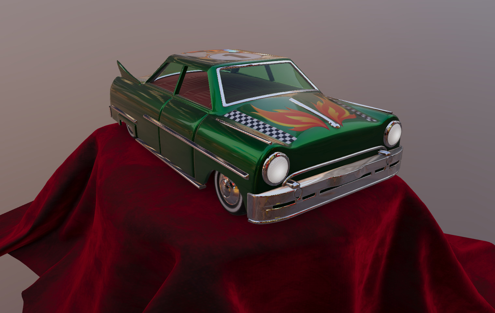

Khronos glTF Sample Renderer
============================

[](https://github.khronos.org/glTF-Sample-Viewer-Release/)

This is the official [Khronos glTF 2.0](https://www.khronos.org/gltf/) Sample Renderer using [WebGL](https://www.khronos.org/webgl/).

Try out the [glTF Sample Viewer](https://github.khronos.org/glTF-Sample-Viewer-Release/) which uses this renderer in combination with a custom frontend.

Table of Contents
-----------------

- [Khronos glTF Sample Renderer](#khronos-gltf-sample-renderer)
  - [Table of Contents](#table-of-contents)
  - [Credits](#credits)
  - [Features](#features)
  - [API](#api)
    - [GltfView](#gltfview)
    - [GltfState](#gltfstate)
    - [ResourceLoader](#resourceloader)
  - [Render Fidelity Tools](#render-fidelity-tools)

Credits
-------

Developed and refactored by [UX3D](https://www.ux3d.io/). Supported by the [Khronos Group](https://www.khronos.org/) and by [Google](https://www.google.com/) for the glTF Draco mesh compression import.
Formerly hosted together with the example frontend at the [glTF Sample Viewer](https://github.com/KhronosGroup/glTF-Sample-Viewer) repository. Original code based on the concluded [glTF-WebGL-PBR](https://github.com/KhronosGroup/glTF-Sample-Viewer/tree/glTF-WebGL-PBR) project. Previously supported by [Facebook](https://www.facebook.com/) for animations, skinning and morphing.

Features
--------

- [x] glTF 2.0
- [x] [KHR_animation_pointer](https://github.com/KhronosGroup/glTF/tree/main/extensions/2.0/Khronos/KHR_animation_pointer)
- [x] [KHR_draco_mesh_compression](https://github.com/KhronosGroup/glTF/tree/main/extensions/2.0/Khronos/KHR_draco_mesh_compression)
- [x] [KHR_lights_punctual](https://github.com/KhronosGroup/glTF/tree/main/extensions/2.0/Khronos/KHR_lights_punctual)
- [x] [KHR_materials_anisotropy](https://github.com/KhronosGroup/glTF/tree/main/extensions/2.0/Khronos/KHR_materials_anisotropy)
- [x] [KHR_materials_clearcoat](https://github.com/KhronosGroup/glTF/tree/main/extensions/2.0/Khronos/KHR_materials_clearcoat)
- [x] [KHR_materials_diffuse_transmission](https://github.com/KhronosGroup/glTF/blob/main/extensions/2.0/Khronos/KHR_materials_diffuse_transmission/README.md)
- [x] [KHR_materials_dispersion](https://github.com/KhronosGroup/glTF/tree/main/extensions/2.0/Khronos/KHR_materials_dispersion)
- [x] [KHR_materials_emissive_strength](https://github.com/KhronosGroup/glTF/tree/KHR_materials_emissive_strength/extensions/2.0/Khronos/KHR_materials_emissive_strength)
- [x] [KHR_materials_ior](https://github.com/KhronosGroup/glTF/tree/main/extensions/2.0/Khronos/KHR_materials_ior)
- [x] [KHR_materials_iridescence](https://github.com/KhronosGroup/glTF/tree/main/extensions/2.0/Khronos/KHR_materials_iridescence)
- [x] [KHR_materials_pbrSpecularGlossiness](https://github.com/KhronosGroup/glTF/tree/main/extensions/2.0/Khronos/KHR_materials_pbrSpecularGlossiness)
- [x] [KHR_materials_sheen](https://github.com/KhronosGroup/glTF/tree/main/extensions/2.0/Khronos/KHR_materials_sheen)
- [x] [KHR_materials_specular](https://github.com/KhronosGroup/glTF/tree/main/extensions/2.0/Khronos/KHR_materials_specular)
- [x] [KHR_materials_transmission](https://github.com/KhronosGroup/glTF/tree/main/extensions/2.0/Khronos/KHR_materials_transmission)
- [x] [KHR_materials_unlit](https://github.com/KhronosGroup/glTF/tree/main/extensions/2.0/Khronos/KHR_materials_unlit)
- [x] [KHR_materials_variants](https://github.com/KhronosGroup/glTF/tree/main/extensions/2.0/Khronos/KHR_materials_variants)
- [x] [KHR_materials_volume](https://github.com/KhronosGroup/glTF/tree/main/extensions/2.0/Khronos/KHR_materials_volume)
- [x] [KHR_mesh_quantization](https://github.com/KhronosGroup/glTF/tree/main/extensions/2.0/Khronos/KHR_mesh_quantization)
- [x] [KHR_texture_basisu](https://github.com/KhronosGroup/glTF/tree/main/extensions/2.0/Khronos/KHR_texture_basisu)
- [x] [KHR_texture_transform](https://github.com/KhronosGroup/glTF/tree/main/extensions/2.0/Khronos/KHR_texture_transform)
- [x] [KHR_xmp_json_ld](https://github.com/KhronosGroup/glTF/tree/main/extensions/2.0/Khronos/KHR_xmp_json_ld)
- [x] [EXT_mesh_gpu_instancing](https://github.com/KhronosGroup/glTF/tree/main/extensions/2.0/Vendor/EXT_mesh_gpu_instancing)
- [x] [EXT_texture_webp](https://github.com/KhronosGroup/glTF/tree/main/extensions/2.0/Vendor/EXT_texture_webp)


API
----

glTF Sample Renderer is made to be integrated into web applications (see [glTF Sample Viewer](https://github.com/KhronosGroup/glTF-Sample-Viewer)) or to be used for automated testing (see [Render Fidelity Tools](#render-fidelity-tools)).

The API consists of several components that in combination allow flexible configuration of the glTF viewer.

More detailed information about the API is listed in the [api documentation](API.md).

### GltfView

The GltfView component is associated with one WebGL2 context. In practice this means it will be associated with one HTML5 Canvas. This component manages the interaction between the canvas and the GL context. It therefore specifies the viewport, the swapchain and can be used to schedule frame renders.

```js
const view = new GltfView(webGl2Context);
```

The view is also used to render frames, either on every window repaint event or on demand, e.g. when taking a frame capture.

```js
const update = () =>
{
    view.renderFrame(state, canvas.width, canvas.height);
    window.requestAnimationFrame(update);
};
window.requestAnimationFrame(update);
```

### GltfState

The GltfState encapsulates the state of the content of a GltfView. *As currently some WebGL resources are stored directly in the Gltf objects, the state cannot be shared between views.*

```js
const state = view.createState();
state.sceneIndex = 0;
state.animationIndices = [0, 1, 2];
state.animationTimer.start();
```

The state is passed to the `view.renderFrame` function to specify the content that should be rendered.

### ResourceLoader

The ResourceLoader can be used to load external resources and make them available to the renderer.

```js
state.gltf = await resourceLoader.loadGltf("path/to/some.gltf");
```

Render Fidelity Tools
---------------------
The glTF Sample Renderer is integrated into Google's [render fidelity tools](https://github.com/google/model-viewer/tree/master/packages/render-fidelity-tools). The render fidelity tools allow the comparison of different renderers. To run the project follow the instructions [here](https://github.com/google/model-viewer/blob/master/README.md) and [here](https://github.com/google/model-viewer/blob/master/packages/render-fidelity-tools/README.md). For information on how the glTF Sample Renderer was integrated see the [pull request on Github](https://github.com/google/model-viewer/pull/1962).
